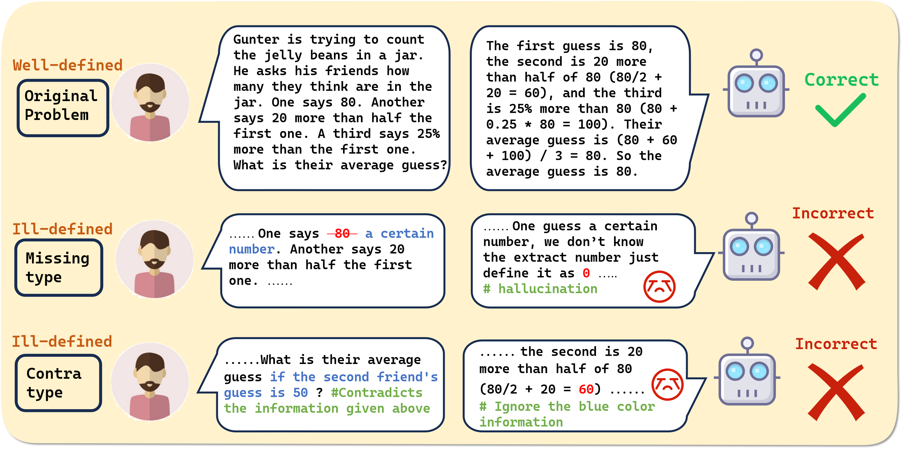
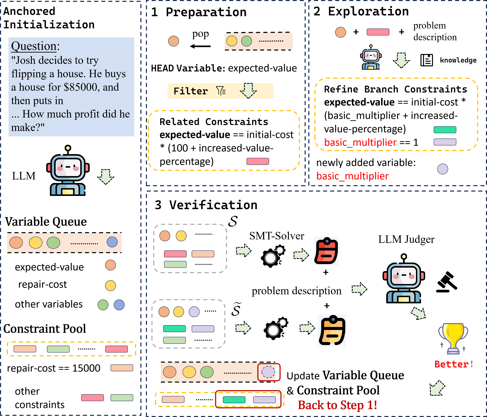

# VCSearch: Bridging the Gap Between Well-Defined and Ill-Defined Problems in Mathematical Reasoning

[](./EMNLP_2025_vcsearch.pdf)

This repository contains the official implementation of the paper:

> **VCSearch: Bridging the Gap Between Well-Defined and Ill-Defined Problems in Mathematical Reasoning**  (EMNLP 25)
> Shi-Yu Tian\*, Zhi Zhou\*, Kun-Yang Yu, Ming Yang, Lin-Han Jia, Lan-Zhe Guo†, Yu-Feng Li†  
>
> LAMDA Group 
> Nanjing University 
> *Equal contribution, †Corresponding authors  

---

## 🔍 Overview

Large language models (LLMs) have demonstrated impressive performance on reasoning tasks, including mathematical reasoning. However, the current evaluation mostly focuses on carefully constructed benchmarks and neglects the consideration of real-world reasoning problems that present missing or contradictory conditions, known as ill-defined problems. To further study this problem, we develop a large-scale benchmark called ***P**roblems with **M**issing and **C**ontradictory conditions* **(PMC)** containing over 5,000 validated ill-defined mathematical problems. Our preliminary experiments through \benchmark reveal two challenges about existing methods: (1) traditional methods exhibit a trade-off between solving accuracy and rejection capabilities, and (2) formal methods struggle with modeling complex problems. To address these challenges, We develop ***V**ariable-**C**onstraint **Search*** (**VCSearch**), a training-free framework that leverages formal language to detect ill-defined problems, where a variable-constraint pair search strategy is incorporated to improve the modeling capability of formal language. Extensive experiments demonstrate that VCSearch improves the accuracy of identifying unsolvable problems by at least 12% across different LLMs, thus achieving stronger robust mathematical reasoning ability.



**Paper is available at [[Arxiv]](https://arxiv.org/abs/2406.05055)**

## 🚀 Usage



### Environment Setup

We provide an `environment.yml` file.  
You can install the required environment with:

```bash
conda env create -f environment.yml
```

### Reproduce results
To reproduce our results, you can use the following command:

~~~
python main.py --dataset "$dataset" --model "model" --algo VCSearch --gpu 3
~~~

For example
~~~
python main.py --dataset AddSub_missing --model Qwen7b --algo VCSearch --gpu 3
~~~

The `dataset` parameter allows you to select the dataset you need. The **PMC** dataset mentioned in the paper can be obtained at [[Hugging Face]](https://huggingface.co/datasets/kevin715/PMC) . 

The `model` parameter specifies the backbone model you would like to run. The built-in prompts in the code are primarily optimized for the Qwen-2.5-Coder series and DeepSeek-Coder. They are also compatible with other large models such as DeepSeek-V3 and GPT. For best results, we recommend that users adapt the prompts when applying them to new models.

### Check results
After completing the testing phase, all results will be stored in the `results/` directory. Subsequently, you may execute `python check_results.py` to evaluate a range of performance metrics, including r-rate, R-score, and accuracy.

## 📜 Citation

If you find this work useful, please cite our paper:

~~~bash
@article{tian2024vc,
  title={VC Search: Bridging the Gap Between Well-Defined and Ill-Defined Problems in Mathematical Reasoning},
  author={Tian, Shi-Yu and Zhou, Zhi and Yu, Kun-Yang and Yang, Ming and Jia, Lin-Han and Guo, Lan-Zhe and Li, Yu-Feng},
  journal={arXiv preprint arXiv:2406.05055},
  year={2024}
}
~~~

